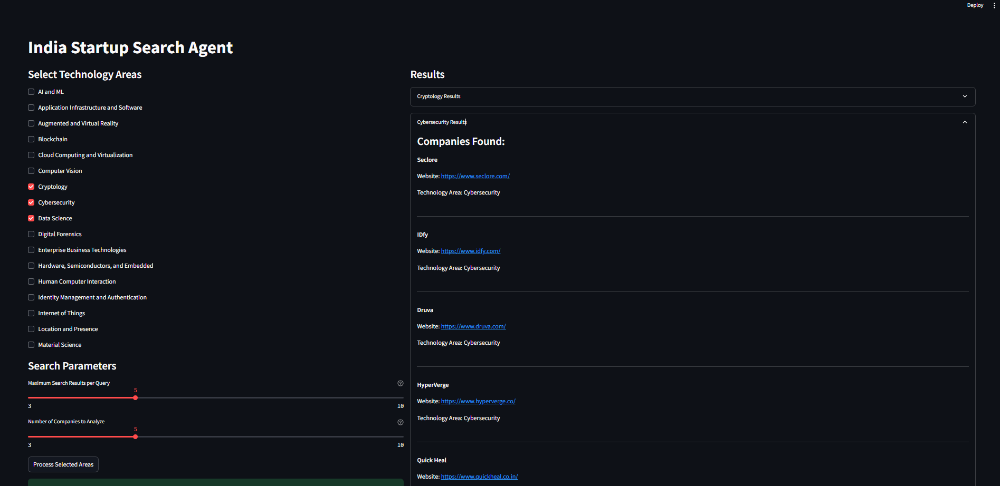

# Indian Tech Startup Research Agent

An intelligent agent system designed to research and catalog emerging Indian technology startups across various technology domains. The system uses AI-powered search and data extraction capabilities to maintain an up-to-date database of promising startups in India's tech ecosystem.

## Features

- Automated research and data extraction for Indian tech startups
- Coverage of 25+ technology areas including AI/ML, Blockchain, IoT, etc.
- AI-powered intelligent search using GPT-4 and Tavily API
- Automated data persistence in MySQL database
- Configurable search parameters and technology areas
- Result export in both database and text file formats



## Project Structure

```
indian-tech-startup-agent/
├── utils/
│   ├── db.py          # Database operations and models
│   └── helper.py      # Utility functions and data processing
├── agent.py           # Core agent implementation and tools
├── main.py           # Main execution script
├── requirements.txt  # Project dependencies
└── results/         # Generated results directory
    └── results_{tech_area}.txt
```

## Prerequisites

- Python 3.8+
- MySQL Server
- OpenAI API Key
- Tavily API Key

## Dependencies

```
python-dotenv
openai
tavily-python
pydantic
sqlalchemy
pymysql
pandas
ipython
nest-asyncio
httpx
devtools
pydantic-ai
mysql-connector-python
```

## Environment Setup

1. Create a `.env` file in the root directory with the following variables:

```env
OPENAI_API_KEY=your_openai_api_key
TAVILY_API_KEY=your_tavily_api_key
DB_USER=your_mysql_username
DB_PASSWORD=your_mysql_password
DB_HOST=localhost
DB_NAME=startups_db
DB_PORT=3306
```

2. Create a MySQL database:

```sql
CREATE DATABASE startups_db;
```

## Installation

1. Clone the repository:
```bash
git clone <repository-url>
cd indian-tech-startup-agent
```

2. Create and activate a virtual environment:
```bash
python -m venv venv
source venv/bin/activate  # On Windows: venv\Scripts\activate
```

3. Install dependencies:
```bash
pip install -r requirements.txt
```

## Usage

1. Run the main script:
```bash
python main.py
```

The script will:
- Process each technology area sequentially
- Save results to both database and text files
- Create a `results` directory with individual files for each tech area
- Handle API rate limiting and error cases

## Technology Areas Covered

The system researches startups in the following technology domains:

- AI and ML
- Application Infrastructure and Software
- Augmented and Virtual Reality
- Blockchain
- Cloud Computing and Virtualization
- Computer Vision
- Cryptology
- Cybersecurity
- Data Science
- Digital Forensics
- Enterprise Business Technologies
- Hardware, Semiconductors, and Embedded
- Human Computer Interaction
- Identity Management and Authentication
- Internet of Things
- Location and Presence
- Material Science
- Mobility and End Points
- Natural Language Processing
- Next Generation Computing
- Operating Systems
- Quantum Technology
- Software Defined Infrastructure
- Unmanned Aerial Vehicles
- Wireless and Networking Technologies
- 5G and 6G

## Database Schema

The system uses a simple but effective database schema:

```sql
CREATE TABLE companies (
    id INTEGER PRIMARY KEY AUTO_INCREMENT,
    name VARCHAR(255) NOT NULL,
    website VARCHAR(255) NOT NULL,
    tech_area VARCHAR(100) NOT NULL,
    INDEX (name),
    INDEX (tech_area)
);
```

## Contributing

Contributions are welcome! Here are some ways you can contribute:

- Add new technology areas
- Improve search accuracy
- Enhance data validation
- Add new data export formats
- Improve error handling
- Add tests

## Error Handling

The system includes comprehensive error handling for:
- Database connection issues
- API rate limiting
- Invalid search results
- Data validation errors
- File system operations

## Limitations

- Limited to Indian startups only
- Depends on search API availability
- Results quality depends on GPT-4 accuracy
- Rate limited by API constraints
- Requires manual verification for critical data

## License

This project is licensed under the MIT License - see the LICENSE file for details.